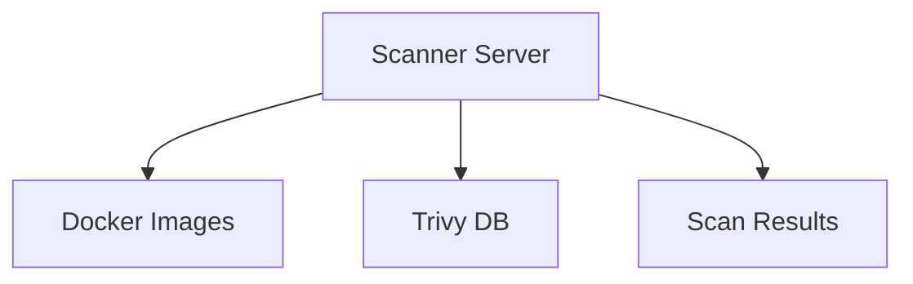
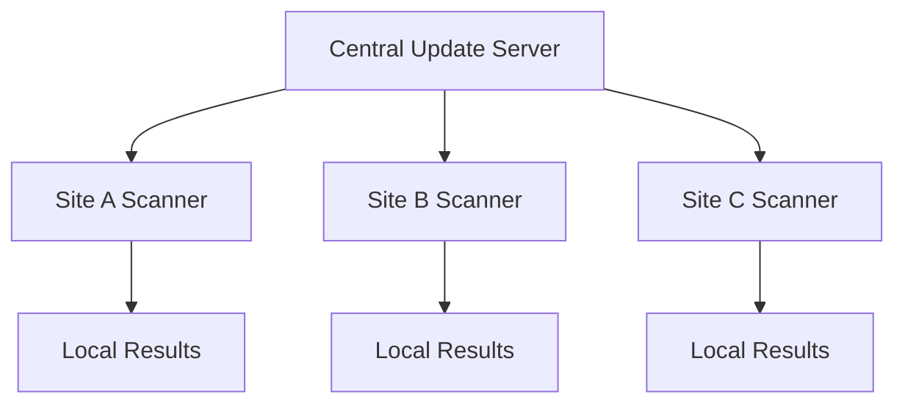

# Trivy Offline Scanner - Deployment Guide

This document provides deployment instructions for production environments.

## 🏗️ Deployment Architectures

### 1. Single Server Deployment
For small environments or development setups.



### 2. Hub and Spoke Model
For larger organizations with multiple sites.



### 3. Air-Gapped Deployment
For high-security environments.


## 📋 Pre-Deployment Checklist

### Infrastructure Requirements
- [ ] **Compute**: 2+ CPU cores, 4GB RAM minimum
- [ ] **Storage**: 10GB+ available (SSD recommended)
- [ ] **Network**: Outbound HTTPS for updates (if not air-gapped)
- [ ] **OS**: Linux with Docker 20.10+

### Security Requirements
- [ ] **Firewall**: Configure outbound rules for updates
- [ ] **Access Control**: Limit who can update databases
- [ ] **Audit Logging**: Enable system audit trails
- [ ] **Backup Strategy**: Plan for database backups

### Operational Requirements
- [ ] **Monitoring**: Set up database age alerts
- [ ] **Maintenance Windows**: Schedule update periods
- [ ] **Documentation**: Create runbooks
- [ ] **Training**: Ensure team knows procedures

## 🚀 Installation Methods

### Method 1: Manual Installation

```bash
# 1. Create service user
sudo useradd -r -s /bin/false trivy
sudo mkdir -p /opt/trivy/{trivy-db,trivy-cache,backups,scan-results}
sudo chown -R trivy:trivy /opt/trivy

# 2. Install scripts
sudo cp scan-offline.sh update-trivy-offline.sh /opt/trivy/
sudo chmod +x /opt/trivy/*.sh

# 3. Initial database setup
sudo -u trivy /opt/trivy/scan-offline.sh setup

# 4. Create systemd service (optional)
sudo cp trivy-scanner.service /etc/systemd/system/
sudo systemctl enable trivy-scanner
```

### Method 2: Container Deployment

```yaml
# docker-compose.prod.yml
version: '3.8'
services:
  trivy-scanner:
    image: aquasec/trivy:latest
    volumes:
      - ./trivy-db:/trivy-db:ro
      - ./trivy-cache:/root/.cache/trivy
      - /var/run/docker.sock:/var/run/docker.sock:ro
    environment:
      - TRIVY_DB_REPOSITORY=file:///trivy-db
      - TRIVY_SKIP_DB_UPDATE=true
    command: server --listen 0.0.0.0:8080
    ports:
      - "8080:8080"
    restart: unless-stopped
```

### Method 3: Kubernetes Deployment

```yaml
apiVersion: apps/v1
kind: Deployment
metadata:
  name: trivy-scanner
spec:
  replicas: 2
  selector:
    matchLabels:
      app: trivy-scanner
  template:
    metadata:
      labels:
        app: trivy-scanner
    spec:
      containers:
      - name: trivy
        image: aquasec/trivy:latest
        env:
        - name: TRIVY_SKIP_DB_UPDATE
          value: "true"
        volumeMounts:
        - name: trivy-db
          mountPath: /trivy-db
          readOnly: true
        - name: trivy-cache
          mountPath: /root/.cache/trivy
      volumes:
      - name: trivy-db
        persistentVolumeClaim:
          claimName: trivy-db-pvc
      - name: trivy-cache
        persistentVolumeClaim:
          claimName: trivy-cache-pvc
```

## 🔧 Production Configuration

### Environment Variables

```bash
# /etc/environment or ~/.bashrc
export TRIVY_DB_REPOSITORY="file:///opt/trivy/trivy-db"
export TRIVY_CACHE_DIR="/opt/trivy/trivy-cache"
export TRIVY_SKIP_DB_UPDATE="true"
export TRIVY_SKIP_JAVA_DB_UPDATE="true"
export TRIVY_TIMEOUT="10m"
export TRIVY_QUIET="false"
```

### Systemd Service

Create `/etc/systemd/system/trivy-scanner.service`:

```ini
[Unit]
Description=Trivy Container Scanner
After=docker.service
Requires=docker.service

[Service]
Type=oneshot
User=trivy
Group=trivy
WorkingDirectory=/opt/trivy
ExecStart=/opt/trivy/scan-offline.sh scan -i %i
StandardOutput=journal
StandardError=journal

[Install]
WantedBy=multi-user.target
```

### Cron Jobs for Maintenance

```bash
# /etc/cron.d/trivy-maintenance
# Check database age daily at 9 AM
0 9 * * * trivy /opt/trivy/scripts/check-db-age.sh

# Clean cache weekly on Sunday at 2 AM
0 2 * * 0 trivy /opt/trivy/scripts/cleanup-cache.sh

# Update database weekly on Monday at 3 AM (if internet available)
0 3 * * 1 trivy /opt/trivy/update-trivy-offline.sh --skip-docker
```

## 📊 Monitoring and Alerting

### Prometheus Metrics

```bash
# /opt/trivy/scripts/export-metrics.sh
#!/bin/bash
# Export Trivy metrics for Prometheus

DB_METADATA="/opt/trivy/trivy-db/metadata.json"
METRICS_FILE="/var/lib/node_exporter/textfile_collector/trivy.prom"

if [ -f "$DB_METADATA" ]; then
    UPDATED_AT=$(jq -r '.UpdatedAt' "$DB_METADATA")
    DB_TIME=$(date -d "$UPDATED_AT" +%s 2>/dev/null || echo 0)
    CURRENT_TIME=$(date +%s)
    AGE_DAYS=$(( (CURRENT_TIME - DB_TIME) / 86400 ))
    
    cat > "$METRICS_FILE" << EOF
# HELP trivy_database_age_days Age of Trivy vulnerability database in days
# TYPE trivy_database_age_days gauge
trivy_database_age_days $AGE_DAYS

# HELP trivy_database_version Version of Trivy vulnerability database
# TYPE trivy_database_version gauge
trivy_database_version{version="$(jq -r '.Version' "$DB_METADATA")"} 1
EOF
fi
```

### Alerting Rules

```yaml
# prometheus-alerts.yml
groups:
- name: trivy-alerts
  rules:
  - alert: TrivyDatabaseOld
    expr: trivy_database_age_days > 7
    for: 1h
    labels:
      severity: warning
    annotations:
      summary: "Trivy database is outdated"
      description: "Trivy vulnerability database is {{ $value }} days old"
      
  - alert: TrivyDatabaseMissing
    expr: up{job="trivy-exporter"} == 0
    for: 5m
    labels:
      severity: critical
    annotations:
      summary: "Trivy database metrics missing"
      description: "Cannot collect Trivy database metrics"
```

## 🔒 Security Hardening

### File Permissions

```bash
# Set secure permissions
sudo chown -R trivy:trivy /opt/trivy
sudo chmod 750 /opt/trivy
sudo chmod 755 /opt/trivy/trivy-db
sudo chmod 755 /opt/trivy/trivy-cache
sudo chmod 700 /opt/trivy/backups
sudo chmod 644 /opt/trivy/trivy-db/*
sudo chmod +x /opt/trivy/*.sh
```

### Network Security

```bash
# Firewall rules for updates (adjust as needed)
sudo iptables -A OUTPUT -p tcp --dport 443 -d github.com -j ACCEPT
sudo iptables -A OUTPUT -p tcp --dport 443 -d ghcr.io -j ACCEPT
sudo iptables -A OUTPUT -p tcp --dport 443 -d aquasec.github.io -j ACCEPT
```

### SELinux/AppArmor

For environments with mandatory access controls:

```bash
# SELinux context
sudo setsebool -P container_manage_cgroup on
sudo semanage fcontext -a -t container_file_t "/opt/trivy(/.*)?"
sudo restorecon -R /opt/trivy
```

## 📈 Performance Tuning

### Storage Optimization

```bash
# Move cache to faster storage
sudo mkdir /mnt/ssd/trivy-cache
sudo mv /opt/trivy/trivy-cache/* /mnt/ssd/trivy-cache/
sudo ln -sf /mnt/ssd/trivy-cache /opt/trivy/trivy-cache
```

### Docker Configuration

```json
{
  "default-runtime": "runc",
  "storage-driver": "overlay2",
  "storage-opts": [
    "overlay2.override_kernel_check=true"
  ],
  "log-driver": "json-file",
  "log-opts": {
    "max-size": "10m",
    "max-file": "3"
  },
  "default-ulimits": {
    "memlock": {
      "name": "memlock",
      "hard": -1,
      "soft": -1
    }
  }
}
```

## 🔄 Backup and Recovery

### Database Backup Strategy

```bash
#!/bin/bash
# /opt/trivy/scripts/backup-database.sh

BACKUP_DIR="/opt/trivy/backups"
DATE=$(date +%Y%m%d-%H%M%S)
BACKUP_NAME="trivy-backup-$DATE"

# Create backup
mkdir -p "$BACKUP_DIR/$BACKUP_NAME"
cp -r /opt/trivy/trivy-db "$BACKUP_DIR/$BACKUP_NAME/"
cp -r /opt/trivy/trivy-cache "$BACKUP_DIR/$BACKUP_NAME/"

# Compress backup
cd "$BACKUP_DIR"
tar -czf "$BACKUP_NAME.tar.gz" "$BACKUP_NAME"
rm -rf "$BACKUP_NAME"

# Keep only last 10 backups
ls -t *.tar.gz | tail -n +11 | xargs -r rm
```

### Recovery Procedures

```bash
# Restore from backup
BACKUP_FILE="trivy-backup-20250107-120000.tar.gz"

# Stop services
sudo systemctl stop trivy-scanner

# Restore database
cd /opt/trivy/backups
tar -xzf "$BACKUP_FILE"
sudo rm -rf /opt/trivy/trivy-db /opt/trivy/trivy-cache
sudo mv trivy-backup-*/trivy-db /opt/trivy/
sudo mv trivy-backup-*/trivy-cache /opt/trivy/
sudo chown -R trivy:trivy /opt/trivy

# Start services
sudo systemctl start trivy-scanner
```

## 📝 Operational Procedures

### Daily Operations

1. **Check system health**
   ```bash
   sudo systemctl status trivy-scanner
   ```

2. **Verify database age**
   ```bash
   /opt/trivy/scripts/check-db-age.sh
   ```

3. **Monitor disk usage**
   ```bash
   df -h /opt/trivy
   ```

### Weekly Operations

1. **Update database** (if internet available)
   ```bash
   sudo -u trivy /opt/trivy/update-trivy-offline.sh
   ```

2. **Clean cache**
   ```bash
   sudo -u trivy /opt/trivy/scripts/cleanup-cache.sh
   ```

3. **Review scan results**
   ```bash
   ls -la /opt/trivy/scan-results/
   ```

### Monthly Operations

1. **Review and rotate logs**
2. **Update documentation**
3. **Security assessment**
4. **Performance review**

## 🚨 Incident Response

### Database Corruption

```bash
# 1. Stop scanner
sudo systemctl stop trivy-scanner

# 2. Restore from backup
cd /opt/trivy/backups
tar -xzf latest-backup.tar.gz
sudo rm -rf /opt/trivy/trivy-db
sudo mv backup/trivy-db /opt/trivy/
sudo chown -R trivy:trivy /opt/trivy

# 3. Verify integrity
/opt/trivy/scan-offline.sh scan -i alpine:latest

# 4. Start scanner
sudo systemctl start trivy-scanner
```

### Update Failures

```bash
# 1. Check logs
journalctl -u trivy-scanner -f

# 2. Manual update
sudo -u trivy /opt/trivy/scan-offline.sh setup

# 3. Verify functionality
/opt/trivy/scan-offline.sh scan -i alpine:latest
```

## 📚 Documentation Requirements

Maintain the following documentation:

1. **Network Diagram**: Show scanner placement and data flows
2. **Runbooks**: Step-by-step procedures for common tasks
3. **Security Policies**: Access controls and audit requirements
4. **Disaster Recovery Plan**: Backup and restoration procedures
5. **Change Management**: Process for updates and modifications

---

**Next Steps**: After deployment, see [TRIVY_OFFLINE_GUIDE.md](TRIVY_OFFLINE_GUIDE.md) for advanced configuration and maintenance procedures.